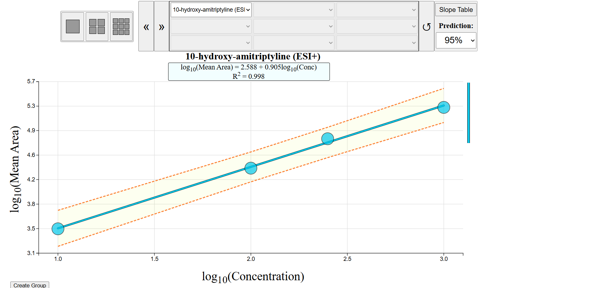
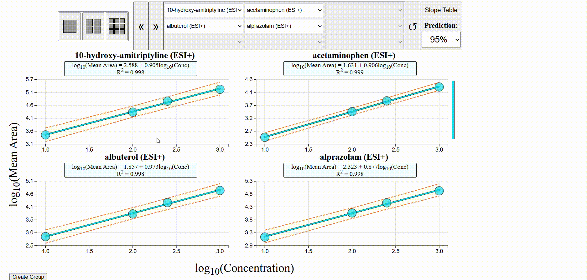

# INTERPRET NTA qNTA Interactive Cal Curves

**GitHub:** <https://github.com/carret938/INTERPRET-NTA-qNTA-Interactive_Cal_Curve>

**Author:** E. Tyler Carr

This repository is for the interactive calibration curves for the INTERPRET NTA qNTA suite of visualizations.

This comes with a .xslx file filled with sample data to generate an example visualization.

## Dependencies

This project requires the following libraries:

- [D3.js](https://d3js.org/) (version 7)
- [SheetJS (xlsx)](https://sheetjs.com/) (version 0.17.0)

## Installation

To include these dependencies in your project, add the following `<script>` tags to your `index.html` file:

```html
<script src="https://d3js.org/d3.v7.min.js"></script>
<script src="https://cdnjs.cloudflare.com/ajax/libs/xlsx/0.17.0/xlsx.core.min.js"></script>
```

Otherwise, you can use relative imports using the local files `./js/d3.v7.min.js` and `./js/xlsx.core.min.js`.

## Functionality

The Calibration Curves are scatter plots of log(Mean Area) vs log(Concentration) with a line of best fit calculated via ordinary least squares and prediction intervals shown. The line of best fit equation and R-squared values are shown in the subtitle under the chemical name for each plot.



### On-hovers

Hovering over a node on one of the plots will populate a tooltip with relevant information about that point.



### Pagination, Dropdown Menus and Resolution

You can choose to view your data in a 1x1, 2x2 (default) or 3x3 grid of plots - the "resolution". Clicking on the ">>" button will paginate the plots to the next subset of the dataset (1x1 will move to the next chemical, 2x2 will move to the next 4 chemicals, 3x3 will move to the next 9 chemicals). The "<<" button will paginate to the previous subset of chemicals.

Using the dropdown menus at the top, you can choose which chemical is shown in each plot, or you can choose to make the plot blank.

Clicking the reset button immediately to the right of the dropdown menus will reset the chemical subset being shown to the first, first 4 or first 9 chemicals in your data depending on which resolution is toggled.


### Prediction Intervals

By default, plots with 3 or more points have the 95% prediction intervals shown. This can be changed to 90% or 99% by using the dropdown menu on the far right side of the interface labeled "Prediction:".


### Exportable Table of Slopes

For users that are particularly interested in the slopes of the best fit lines, a table of slopes may be generated by clicking the "Slope Table" button in the top right. Clicking on the "Slope" column header will sort the table by slope in descending order, clicking again sorts in ascending order. Clicking the "Chemical Name" column header will reset the sorting back to its original state.

Clicking the "Export to XLSX" button will download a .xlsx file of the table. Similarly, the "Copy to Clipboard" button will copy the table's data to your clipboard so it can be pasted into your software of choice.


### Grouping

An unlimited number of custom groups can be made by clicking the "Create Group" button in the bottom right. Clicking the button once opens a box that acts as an interface for customizing your new group.

You can give your group a name and a description in the respective boxes. Chemicals may be added to the group by selecting one from the dropdown menu and clicking the "Add Chemical" button. Clicking the red bin beside a chemical in your group will remove it from the group.

Once populated with chemicals, you can choose to view only the chemicals in that group by clicking the glasses icon in the bottom right of the group interface.

A group may be deleted by clicking the red trash bin in the bottom right of the group interface. If the group has been assigned a name or has been populated with chemicals, a popup will display confirming that you meant to delete the group.


### Excluding Points and Chemicals

Points can be excluded from your dataset by clicking the node on a plot. This will turn the point black, and recalculate the line of best fit and prediction intervals on the fly.

Entire chemicals (or groups of chemicals) may be excluded from your dataset by creating a group and checking the "Remove group chemicals from output: " checkbox at the bottom of the group interface.


